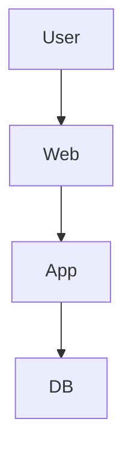

# 3-Tier Architecture Using Terraform on AWS

## Overview
This project provisions a production-style 3-tier architecture
using Infrastructure as Code (Terraform). The architecture separates
Web, Application, and Database tiers with strict security controls.

## Architecture Diagram

---

## 7️⃣ HOW TO EXPLAIN THIS IN INTERVIEW (POWER ANSWER)

> “I built a 3-tier architecture using Terraform with separate Web, App, and DB tiers, each isolated by security groups and monitored via CloudWatch.”

That answer = **real cloud engineer mindset**.

---

## 🏆 WHY THIS IS A BIG UPGRADE

✔ Shows system design
✔ Shows security understanding
✔ Shows IaC maturity
✔ Shows scalability thinking
✔ Stronger than single-EC2 projects

---

## 👉 NEXT (OPTIONAL – ELITE LEVEL)
I can:
- Add **Load Balancer**
- Add **Auto Scaling**
- Add **RDS instead of EC2 DB**
- Integrate **Project 1 CI/CD with this infra**
- Prepare **interview Q&A**

Just tell me 👍
